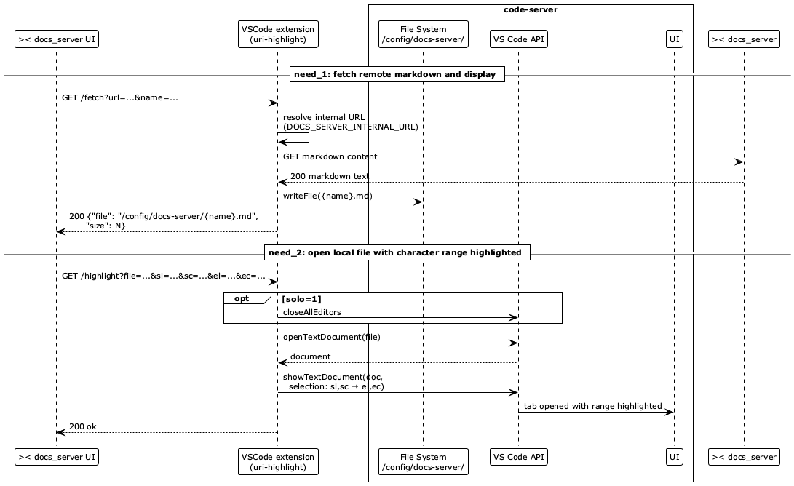

# Architecture

## Concerning the Dockerfile

**Docker multi-stage build** (`DockerContext/Dockerfile`):

1. Stage 1 (`node:20-slim`): packages the extension via `vsce`, unzips the VSIX.
2. Stage 2 (`lscr.io/linuxserver/code-server:latest`): copies unpacked extension into
   `/app/code-server/lib/vscode/extensions/local.uri-highlight-0.0.1/` — code-server picks it
   up as a workspace-local extension without registry registration.

**Extension** (`DockerContext/my-ext/uri-highlight/extension.js`): activates on `onStartupFinished`
and starts an HTTP trigger server on port 8085 with endpoints document with OpenAPI.

**No `devcontainer.json`** is used; the extension is installed at a fixed path that code-server
auto-discovers.

### Notes

Above image was generated from [Sequence.puml](./Sequence.puml) with
`brew install plantuml` and `plantuml -t png Sequence.puml`.
